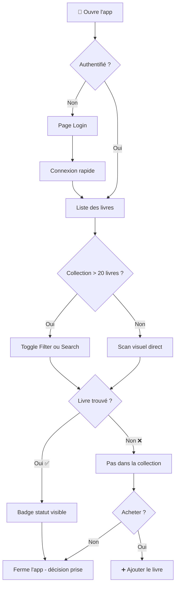
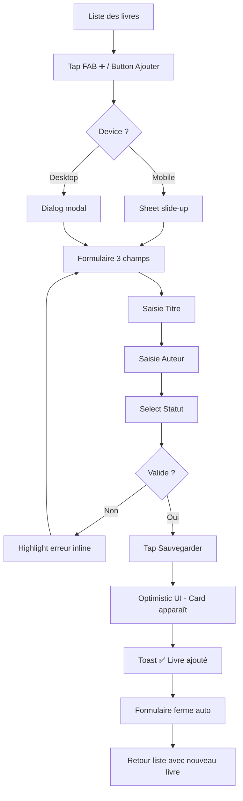
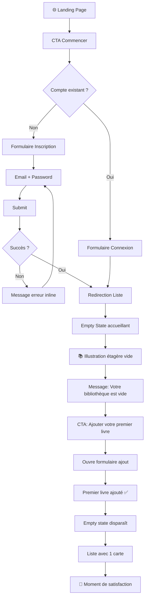
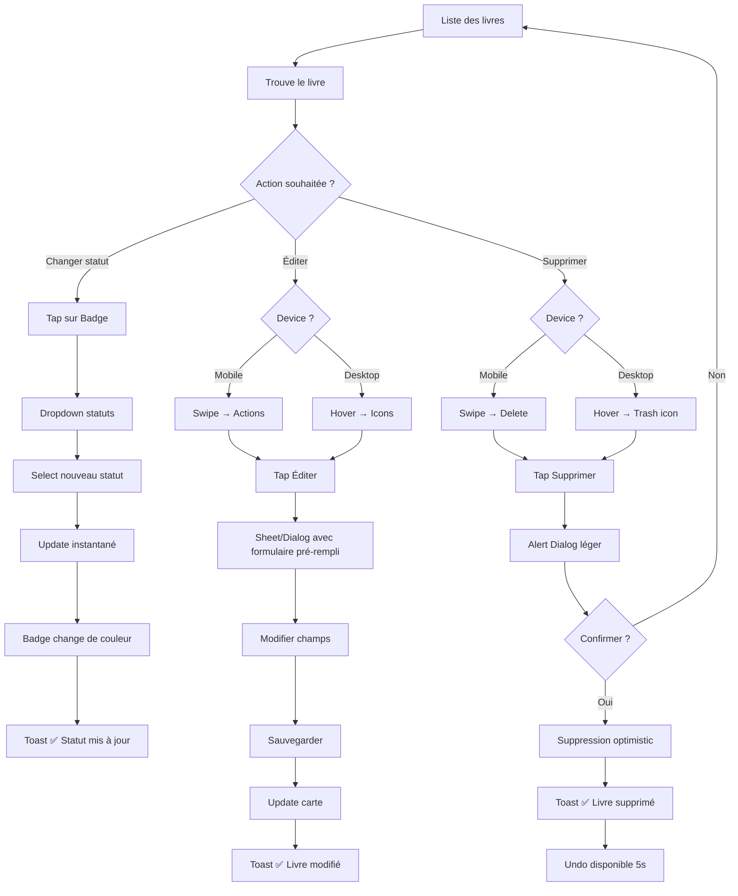

# UX Design Specification Ma Bibliotheque

**Author:** MiKL
**Date:** 2025-12-17

---

## Executive Summary

### Project Vision

Ma Bibliothèque incarne la simplicité radicale : une application personnelle de gestion de livres qui fait exactement ce qu'on lui demande, sans fioritures. Pas d'API externes, pas d'images, pas de fonctionnalités sociales. Un anti-Goodreads assumé.

### Target Users

**Persona principal : Alex, le lecteur régulier**
- A racheté plusieurs fois le même livre par oubli
- Frustré par la complexité des solutions existantes
- Utilise son smartphone en librairie, sa tablette sur le canapé, son desktop pour la saisie massive
- Veut une réponse instantanée : "Est-ce que je possède ce livre ?"

### Key Design Challenges

1. **Responsive design complet** : Expérience optimale sur mobile, tablet ET desktop
2. **Mobile-first mais pas mobile-only** : Chaque breakpoint doit être pensé, pas juste adapté
3. **Rapidité d'ajout** : Objectif < 30 secondes pour cataloguer un livre (tous devices)
4. **Filtrage instantané** : Navigation fluide dans une collection croissante
5. **Clarté immédiate** : Interface auto-explicative, zéro onboarding

### Design Opportunities

1. **Expérience zen différenciante** : Contraste assumé avec les apps surchargées
2. **Adaptation intelligente par device** : Drawer sur mobile, Dialog sur desktop
3. **Micro-interactions satisfaisantes** : Feedback tactile/visuel agréable à chaque action
4. **Statuts visuellement distincts** : Reconnaissance instantanée via couleurs/badges
5. **Empty state accueillant** : Premier contact positif et invitation à l'action

---

## Core User Experience

### Defining Experience

L'expérience centrale de Ma Bibliothèque se résume à une question : "Est-ce que je possède ce livre ?". Tout le design découle de cette interaction clé qui doit être résolue en moins de 5 secondes, même avec une collection de 100+ livres.

**Action principale :** Filtrer et trouver un livre dans sa collection
**Action critique :** Ajouter un nouveau livre en moins de 30 secondes
**Loop utilisateur :** Ouvrir → Filtrer/Chercher → Trouver → Fermer

### Platform Strategy

- **Type :** Web Application (SPA) responsive
- **Breakpoints :** Mobile (< 640px), Tablet (640-1024px), Desktop (> 1024px)
- **Interactions :** Touch-first avec support complet clavier/souris
- **Offline :** Non supporté (dépendance Supabase)
- **Contraintes :** Pas d'API device natives (caméra, GPS, etc.)

### Effortless Interactions

| Interaction | Implementation |
|-------------|----------------|
| Filtrage par statut | Toggle Group instantané, pas de rechargement |
| Ajout de livre | Formulaire 3 champs, validation live, auto-close |
| Changement de statut | Tap direct sur badge du livre |
| Suppression | Action discrète avec confirmation légère |

### Critical Success Moments

1. **Premier ajout réussi** - Transition fluide de l'empty state vers la collection
2. **Vérification rapide** - < 5 secondes de l'ouverture au résultat
3. **Reconnaissance instantanée** - Le livre cherché est immédiatement identifiable
4. **Scalabilité** - Performance maintenue avec 100+ livres

### Experience Principles

1. **Règle des 3 taps** - Toute action principale en 3 interactions maximum
2. **Zéro friction** - Aucune confirmation inutile, aucun popup bloquant
3. **Feedback immédiat** - Réponse visuelle instantanée à chaque action
4. **Cohérence responsive** - Même logique UX adaptée à chaque device

---

## Desired Emotional Response

### Primary Emotional Goals

- **Sérénité** : L'application doit être un havre de paix visuel, en contraste avec les interfaces surchargées
- **Contrôle** : L'utilisateur doit toujours savoir exactement où il en est et ce qu'il possède
- **Efficacité** : Chaque interaction doit sentir rapide et directe
- **Satisfaction** : Le plaisir simple d'un outil qui fait exactement ce qu'on lui demande

### Emotional Journey Mapping

| Étape | Émotion cible |
|-------|---------------|
| Découverte | Soulagement - "Enfin quelque chose de simple" |
| Premier ajout | Satisfaction - "C'était rapide et facile" |
| Usage quotidien | Confiance - "Mon outil fiable" |
| Vérification | Assurance - "Je sais que j'ai cette info" |
| Erreur | Sécurité - "Je peux facilement corriger" |

### Micro-Emotions

**À cultiver :**
- Confiance dans chaque action
- Calme face à l'interface
- Clarté sur l'état du système
- Accomplissement à chaque tâche terminée

**À éviter :**
- Doute sur l'enregistrement des données
- Surcharge cognitive visuelle
- Frustration par trop d'étapes
- Confusion sur la navigation

### Design Implications

| Émotion | Choix de design |
|---------|-----------------|
| Sérénité | Palette douce (olive/crème), whitespace généreux, animations douces |
| Contrôle | Feedback visuel immédiat, états clairs, possibilité d'annuler |
| Efficacité | Formulaires minimaux (3 champs), auto-save, zéro popup bloquant |
| Satisfaction | Micro-animations de succès, toasts positifs non-intrusifs |

### Emotional Design Principles

1. **Respiration visuelle** - Espaces généreux, jamais de densité oppressante
2. **Confirmation passive** - Toast de succès plutôt que dialog de validation
3. **Célébration subtile** - Animations légères de succès, pas de surenchère
4. **Réassurance constante** - États visuels explicites, jamais d'ambiguïté

---

## UX Pattern Analysis & Inspiration

### Inspiring Products Analysis

| Produit | Points forts UX |
|---------|-----------------|
| Apple Notes | Ajout instantané, zéro friction, simplicité radicale |
| Things 3 | Design zen, micro-interactions satisfaisantes, états clairs |
| Clear | Minimalisme extrême, gestures intuitifs, focus absolu |
| Pocket | Sauvegarde 1-tap, liste simple, filtrage efficace |

### Transferable UX Patterns

**Navigation :**
- Liste unique avec filtres Toggle Group
- Floating Action Button (FAB) sur mobile
- Header sticky avec titre et actions

**Interaction :**
- Swipe actions pour édition rapide (mobile)
- Hover actions pour édition rapide (desktop)
- Optimistic UI pour feedback instantané
- Inline status change (tap sur badge)

**Visuel :**
- Cards uniformes pour chaque livre
- Badges colorés par statut de lecture
- Empty state accueillant et actionnable

### Anti-Patterns to Avoid

- Social features (ratings, partage, commentaires)
- Onboarding multi-étapes
- Modals imbriquées
- Double confirmation de suppression
- Infinite scroll sans filtrage
- Navigation complexe multi-niveaux

### Design Inspiration Strategy

**Adopter :** Toggle Group filtrage, Cards épurées, FAB mobile, Toast confirmations
**Adapter :** Swipe → Hover pour desktop, Empty state personnalisé
**Éviter :** Tout élément social, onboarding complexe, popups bloquants

---

## Design System Foundation

### Design System Choice

**Système choisi :** Shadcn/ui avec thème TweakCN personnalisé

**Type d'approche :** Themeable System - composants éprouvés avec personnalisation complète via CSS variables

### Rationale for Selection

1. **Composants accessibles** - Radix UI comme base garantit l'accessibilité (A11y)
2. **Ownership total** - Code copié dans le projet, pas de dépendance runtime
3. **Personnalisation illimitée** - CSS variables pour adapter chaque aspect
4. **Performance** - Pas de bundle bloat, tree-shakable
5. **Écosystème React 18** - Support natif et intégration Tailwind
6. **Documentation excellente** - Exemples et patterns disponibles

### Implementation Approach

**Installation des composants :**
- button, card, input, select, toggle-group (UI de base)
- dialog, sheet, drawer (modales responsive)
- badge, sonner, alert-dialog (feedback)
- form, label (formulaires)
- empty (états vides)

**Intégration du thème :**
- CSS variables personnalisées dans globals.css
- Support dark mode natif
- Typographie Merriweather/Source Serif 4/JetBrains Mono

### Customization Strategy

**Tokens personnalisés :**
- Palette olive/crème alignée avec l'univers "bibliothèque"
- Ombres directionnelles pour effet "carte posée"
- Radius doux (0.425rem) pour un feeling chaleureux

**Composants à étendre :**
- BookCard : Card customisée avec badge statut intégré
- StatusBadge : Badge avec couleurs par statut (À lire, En cours, Lu)
- EmptyLibrary : Empty state personnalisé "bibliothèque vide"

---

## Defining Experience

### The Core Interaction

**L'expérience définissante :** "Est-ce que je possède ce livre ?" → Réponse en 5 secondes maximum.

Cette interaction unique définit toute la valeur du produit. Si nous la réussissons parfaitement, tout le reste suit naturellement.

### User Mental Model

**Métaphore mentale :** Un carnet personnel / inventaire de livres
**Attente :** Rapidité comparable à chercher dans ses contacts téléphoniques
**Solutions actuelles défaillantes :** Excel, notes papier, mémoire
**Frustration principale :** L'incertitude ("Je l'ai ou pas ?")

### Success Criteria

| Critère | Objectif |
|---------|----------|
| Temps de réponse | < 5 secondes (ouverture → réponse) |
| Clarté | Aucune ambiguïté sur la possession |
| Confiance | L'app devient la source de vérité |
| Adoption | Devient un réflexe pré-achat |

### UX Patterns

**Patterns établis adoptés :**
- Liste scrollable avec filtres
- Toggle Group pour filtrage par statut
- Cards uniformes pour reconnaissance rapide

**Pas de patterns novateurs** - La force réside dans l'exécution parfaite de patterns familiers.

### Experience Mechanics

**Initiation :** Ouverture directe sur la liste (pas de splash/loading)
**Interaction :** Tap sur Toggle Group → Filtrage instantané
**Feedback :** Animation fluide, compteur mis à jour, cards visibles immédiatement
**Completion :** "Je l'ai" → ferme l'app | "Je ne l'ai pas" → ajout en 2 taps

---

## Visual Design Foundation

### Color System

**Palette sémantique :**
- `--background` : Crème chaud - fond principal
- `--foreground` : Brun olive - texte
- `--primary` : Vert olive - actions principales, CTA
- `--secondary` : Doré chaud - états secondaires
- `--destructive` : Rouge doux - suppression, erreurs
- `--muted` : Beige léger - éléments désactivés

**Couleurs par statut de lecture :**
- À lire : `--muted` (gris/beige) - neutre, en attente
- En cours : `--secondary` (doré) - actif, progression
- Lu : `--primary` (vert) - complété, succès

### Typography System

**Polices :**
- Sans (UI) : Merriweather - chaleur, lisibilité
- Serif (accents) : Source Serif 4 - élégance littéraire
- Mono : JetBrains Mono - données techniques

**Hiérarchie :**
- H1 : 2rem, Merriweather bold
- H2 : 1.5rem, Merriweather semibold
- Body : 1rem, Merriweather regular
- Small : 0.875rem, Merriweather regular

### Spacing & Layout Foundation

**Unités :**
- Base : 0.25rem (4px)
- Radius : 0.425rem (coins doux)
- Shadows : 3px 3px directionnels (effet carte)

**Principes :**
- Whitespace généreux pour sérénité visuelle
- Gap confortable entre cards (1rem minimum)
- Padding adaptatif par breakpoint

### Accessibility Considerations

- Contraste WCAG AA respecté via palette oklch
- Dark mode complet et cohérent
- Touch targets minimum 44x44px
- Focus visible via ring vert sauge
- Animations réduites si préférence système

---

## Design Direction

### Selected Direction

**Direction principale :** Cards with Shadows (Direction 1)

L'approche "carte posée" avec ombres directionnelles 3px 3px qui respecte parfaitement le design system TweakCN et évoque l'univers physique des livres.

### Rationale

1. **Cohérence avec le design system** - Les ombres directionnelles sont un élément clé du thème TweakCN
2. **Métaphore physique** - L'effet "carte posée" rappelle les fiches de bibliothèque traditionnelles
3. **Hiérarchie visuelle claire** - Les ombres créent une séparation nette entre les éléments
4. **Adaptabilité responsive** - Les cards s'adaptent naturellement à toutes les tailles d'écran

### Layout Strategy by Device

| Device | Layout | Spécificités |
|--------|--------|--------------|
| Mobile (< 640px) | Liste verticale 1 colonne | FAB pour ajout, swipe actions |
| Tablet (640-1024px) | Grille 2 colonnes | Dialog pour ajout/édition |
| Desktop (> 1024px) | Grille 3-4 colonnes OU Table | Hover actions, Dialog modal |

### View Modes (Desktop)

**Mode Cards** (par défaut) :
- Grille responsive 3-4 colonnes
- Effet carte posée avec ombre
- Idéal pour navigation et consultation

**Mode Table** (optionnel) :
- Vue dense type spreadsheet
- Idéal pour saisie/édition massive
- Toggle accessible via icône dans le header

### Card Anatomy

```
┌─────────────────────────────┐
│  [Badge Statut]             │  ← Coin supérieur droit
│                             │
│  Titre du Livre             │  ← H3, Merriweather bold
│  Auteur                     │  ← Body, muted
│                             │
│  [Éditer] [Supprimer]       │  ← Actions au hover/focus
└─────────────────────────────┘
    ↘ Ombre 3px 3px
```

### Status Badge Colors

| Statut | Couleur | Token CSS |
|--------|---------|-----------|
| À lire | Beige/Gris | `--muted` |
| En cours | Doré | `--secondary` |
| Lu | Vert olive | `--primary` |

### Empty State Design

**Illustration :** Étagère ASCII minimaliste
**Message principal :** "Votre bibliothèque est vide"
**Message secondaire :** "Ajoutez votre premier livre pour commencer"
**CTA :** Button primary "Ajouter un livre"

### Design Mockups Reference

Voir `docs/ux-design-directions.html` pour les mockups interactifs des différentes directions explorées.

---

## User Journey Flows

### Journey 1: Quick Check (Vérification rapide)

**Objectif :** Répondre à "Est-ce que je possède ce livre ?" en moins de 5 secondes.

**Contexte type :** Alex est en librairie, hésite devant un livre.



**Points clés :**
- Ouverture directe sur la liste (pas de splash)
- Toggle Group toujours visible pour filtrage instantané
- Recherche possible mais pas obligatoire pour petites collections
- Temps cible : 5 secondes max de l'ouverture à la réponse

---

### Journey 2: Add Book (Ajout de livre)

**Objectif :** Ajouter un nouveau livre en moins de 30 secondes.

**Contexte type :** Alex vient d'acheter un livre et veut l'ajouter immédiatement.



**Points clés :**
- FAB (Floating Action Button) sur mobile, Button dans header sur desktop
- Formulaire minimal : Titre (requis), Auteur (requis), Statut (défaut: "À lire")
- Validation inline, pas de popup d'erreur bloquant
- Optimistic UI : le livre apparaît immédiatement dans la liste
- Auto-close du formulaire après succès

---

### Journey 3: First Use (Première utilisation)

**Objectif :** Guider l'utilisateur de l'inscription à son premier livre ajouté.

**Contexte type :** Alex découvre l'app et veut commencer à cataloguer sa collection.



**Points clés :**
- Inscription minimale (email + password uniquement)
- Empty state accueillant, pas intimidant
- CTA clair vers l'action suivante
- Transition fluide de l'empty state vers la liste peuplée
- Célébration subtile du premier ajout

---

### Journey 4: Manage Collection (Gestion de la collection)

**Objectif :** Permettre l'édition, la suppression et le changement de statut facilement.

**Contexte type :** Alex veut mettre à jour le statut d'un livre qu'il vient de terminer.



**Points clés :**
- Changement de statut en 1 tap (tap sur badge)
- Actions contextuelles : swipe sur mobile, hover sur desktop
- Confirmation de suppression légère (Alert Dialog, pas Modal bloquant)
- Possibilité d'Undo pendant 5 secondes après suppression
- Toasts non-intrusifs pour tous les feedbacks

---

### Journey Patterns

**Patterns de navigation :**
- Entrée directe sur la vue liste (pas de splash/loading)
- Toggle Group toujours visible pour filtrage rapide
- Retour automatique à la liste après chaque action

**Patterns de décision :**
- Actions contextuelles révélées par geste (swipe/hover)
- Tap direct sur badge pour changement de statut inline
- Formulaires minimaux avec validation live

**Patterns de feedback :**
- Optimistic UI pour toutes les mutations
- Toast de confirmation non-bloquant
- Undo disponible pour actions destructives

---

### Flow Optimization Principles

1. **Minimisation des étapes**
   - Ajout : 3 champs seulement
   - Statut : 1 tap sur badge
   - Suppression : 2 taps avec undo

2. **Réduction de la charge cognitive**
   - Un seul écran principal (la liste)
   - Actions secondaires dans sheets/dialogs
   - Pas de navigation multi-niveaux

3. **Feedback et progression**
   - Optimistic UI instantané
   - Toasts positifs et discrets
   - États visuels clairs (badges colorés)

4. **Récupération d'erreurs**
   - Validation inline (pas de popup)
   - Undo pour suppression
   - Messages d'erreur contextuels

---

## Component Strategy

### Design System Components (Shadcn/ui)

**Composants de base utilisés directement :**

| Composant | Usage | Personnalisation |
|-----------|-------|------------------|
| `Button` | Actions primaires/secondaires | Couleurs via tokens |
| `Input` | Champs titre, auteur | Style TweakCN |
| `Select` | Sélecteur de statut | Options statut avec couleurs |
| `Card` | Base pour BookCard | Ombre directionnelle custom |
| `Badge` | Base pour StatusBadge | Couleurs par statut |
| `Dialog` | Modales desktop | Animation fade |
| `Sheet` | Modales mobile (slide-up) | Hauteur adaptative |
| `ToggleGroup` | Filtres par statut | Style segment control |
| `Form` | Validation formulaires | React Hook Form intégré |
| `Label` | Labels accessibles | Association input |
| `AlertDialog` | Confirmation suppression | Minimal, non-intrusif |
| `Sonner` | Toast notifications | Position bottom-right |

### Custom Components

#### BookCard

**Purpose :** Afficher un livre dans la collection avec son statut et actions.

**Anatomy :**
```
┌────────────────────────────────┐
│ [StatusBadge]          [Menu]  │  ← Header avec badge et actions
├────────────────────────────────┤
│                                │
│  Titre du Livre                │  ← H3, font-bold, truncate si long
│  par Auteur                    │  ← Text muted, italic
│                                │
└────────────────────────────────┘
    ↘ shadow (3px 3px var(--border))
```

**Props :**
```typescript
interface BookCardProps {
  id: string;
  title: string;
  author: string;
  status: 'to_read' | 'reading' | 'read';
  onStatusChange: (status: Status) => void;
  onEdit: () => void;
  onDelete: () => void;
}
```

**States :**
- Default : Fond card, ombre visible
- Hover : Légère élévation, actions visibles (desktop)
- Focus : Ring olive visible
- Loading : Opacity réduite pendant mutation

**Variants :**
- `compact` : Pour vue liste dense
- `default` : Pour vue grille

**Accessibility :**
- `role="article"` avec `aria-label` descriptif
- Actions focusables avec raccourcis clavier
- Status annoncé aux lecteurs d'écran

---

#### StatusBadge

**Purpose :** Indicateur visuel du statut de lecture avec action de changement.

**Anatomy :**
```
┌──────────────┐
│ ● En cours   │  ← Dot coloré + Label
└──────────────┘
```

**Props :**
```typescript
interface StatusBadgeProps {
  status: 'to_read' | 'reading' | 'read';
  onClick?: () => void;
  interactive?: boolean;
}
```

**States par statut :**

| Statut | Label | Couleur fond | Couleur texte |
|--------|-------|--------------|---------------|
| `to_read` | À lire | `--muted` | `--muted-foreground` |
| `reading` | En cours | `--secondary` | `--secondary-foreground` |
| `read` | Lu | `--primary` | `--primary-foreground` |

**Behavior :**
- Click → Dropdown avec 3 options de statut
- Changement → Update optimistic + Toast

**Accessibility :**
- `role="button"` si interactif
- `aria-haspopup="listbox"` pour dropdown
- Annonce du statut actuel et des options

---

#### EmptyLibrary

**Purpose :** État vide accueillant pour nouvelle collection.

**Anatomy :**
```
┌─────────────────────────────────────┐
│                                     │
│         ╔═══════════════╗           │
│         ║   📚          ║           │  ← Illustration étagère
│         ║  ═══════════  ║           │
│         ╚═══════════════╝           │
│                                     │
│    Votre bibliothèque est vide      │  ← H2, centered
│                                     │
│   Ajoutez votre premier livre       │  ← Text muted
│   pour commencer votre collection   │
│                                     │
│      [+ Ajouter un livre]           │  ← Button primary
│                                     │
└─────────────────────────────────────┘
```

**Props :**
```typescript
interface EmptyLibraryProps {
  onAddBook: () => void;
}
```

**Accessibility :**
- Illustration décorative (`aria-hidden`)
- CTA focusable et descriptif

---

#### BookForm

**Purpose :** Formulaire d'ajout/édition de livre.

**Anatomy :**
```
┌─────────────────────────────────────┐
│  Ajouter un livre          [×]     │  ← Header avec close
├─────────────────────────────────────┤
│                                     │
│  Titre *                            │
│  ┌─────────────────────────────┐    │
│  │                             │    │  ← Input required
│  └─────────────────────────────┘    │
│                                     │
│  Auteur *                           │
│  ┌─────────────────────────────┐    │
│  │                             │    │  ← Input required
│  └─────────────────────────────┘    │
│                                     │
│  Statut                             │
│  ┌─────────────────────────────┐    │
│  │ À lire              ▼       │    │  ← Select default
│  └─────────────────────────────┘    │
│                                     │
│  [Annuler]        [Sauvegarder]     │  ← Actions
│                                     │
└─────────────────────────────────────┘
```

**Props :**
```typescript
interface BookFormProps {
  mode: 'create' | 'edit';
  initialData?: Book;
  onSubmit: (data: BookFormData) => void;
  onCancel: () => void;
}
```

**Validation :**
- Titre : Required, min 1 char, max 200
- Auteur : Required, min 1 char, max 100
- Statut : Enum, default "to_read"

**Behavior :**
- Validation inline on blur
- Submit disabled si invalide
- Auto-close on success

---

#### StatusFilter

**Purpose :** Toggle Group pour filtrer par statut de lecture.

**Anatomy :**
```
┌─────────────────────────────────────────────────┐
│  [Tous (42)]  [À lire (15)]  [En cours (5)]  [Lu (22)]  │
└─────────────────────────────────────────────────┘
```

**Props :**
```typescript
interface StatusFilterProps {
  value: 'all' | 'to_read' | 'reading' | 'read';
  onChange: (value: Status | 'all') => void;
  counts: { all: number; to_read: number; reading: number; read: number };
}
```

**Behavior :**
- Selection unique
- Compteurs dynamiques
- Filtrage instantané (pas de loading)

---

### Component Implementation Strategy

**Approche de construction :**

1. **Composition over inheritance** - Construire les composants custom en composant les primitives Shadcn/ui
2. **Tokens first** - Utiliser exclusivement les CSS variables du design system
3. **Accessibility by default** - Intégrer ARIA dès la conception
4. **Responsive variants** - Prévoir les adaptations par breakpoint

**Structure de fichiers recommandée :**
```
src/
├── components/
│   ├── ui/           # Shadcn/ui components (généré)
│   │   ├── button.tsx
│   │   ├── card.tsx
│   │   └── ...
│   ├── book/         # Composants métier livre
│   │   ├── book-card.tsx
│   │   ├── book-form.tsx
│   │   └── status-badge.tsx
│   ├── library/      # Composants page bibliothèque
│   │   ├── empty-library.tsx
│   │   ├── status-filter.tsx
│   │   └── book-list.tsx
│   └── layout/       # Composants layout
│       ├── header.tsx
│       └── page-container.tsx
```

---

### Implementation Roadmap

**Phase 1 - MVP Core (Sprint 1)**

| Composant | Priorité | Dépendance |
|-----------|----------|------------|
| BookCard | P0 | Card, Badge |
| StatusBadge | P0 | Badge, Select |
| BookForm | P0 | Form, Input, Select |
| EmptyLibrary | P0 | Button |
| StatusFilter | P0 | ToggleGroup |

**Phase 2 - Polish (Sprint 2)**

| Composant | Priorité | Description |
|-----------|----------|-------------|
| BookCard compact variant | P1 | Vue liste alternative |
| Swipe actions (mobile) | P1 | Actions contextuelles touch |
| Undo toast | P1 | Récupération suppression |

**Phase 3 - Enhancement (Post-MVP)**

| Composant | Priorité | Description |
|-----------|----------|-------------|
| Search input | P2 | Recherche dans collection |
| Sort dropdown | P2 | Tri par titre/auteur/date |
| Bulk actions | P2 | Sélection multiple |

---

## UX Consistency Patterns

### Button Hierarchy

**Principe :** Une seule action primaire visible à la fois.

| Type | Usage | Style |
|------|-------|-------|
| Primary | Action principale (Sauvegarder, Ajouter) | `bg-primary`, plein |
| Secondary | Actions alternatives (Annuler) | `bg-secondary`, outline |
| Ghost | Actions tertiaires (Éditer, Supprimer) | Transparent, hover visible |
| Destructive | Suppression uniquement | `bg-destructive`, confirmation requise |

**Règles :**
- Maximum 1 bouton Primary par vue/modal
- Bouton Primary toujours à droite dans les paires
- Destructive jamais en Primary sauf dans AlertDialog dédié
- Touch target minimum : 44x44px

**Exemples :**
```
[Annuler]  [Sauvegarder]     ← Secondary + Primary
           [+ Ajouter]        ← Primary seul (FAB mobile)
[Éditer] [Supprimer]          ← Ghost + Ghost
```

---

### Feedback Patterns

#### Success (Succès)

**Quand :** Action complétée avec succès (ajout, modification, suppression)

**Implementation :** Toast Sonner bottom-right
```
┌─────────────────────────────┐
│ ✓ Livre ajouté              │
└─────────────────────────────┘
```

**Specs :**
- Durée : 3 secondes auto-dismiss
- Position : Bottom-right (desktop), Bottom-center (mobile)
- Couleur : `--primary` (vert olive)
- Pas de bouton close (auto-dismiss)

---

#### Error (Erreur)

**Quand :** Action échouée (validation, réseau, serveur)

**Types d'erreurs :**

| Type | Affichage | Exemple |
|------|-----------|---------|
| Validation | Inline sous le champ | "Le titre est requis" |
| Réseau | Toast persistant | "Connexion perdue. Réessayer ?" |
| Serveur | Toast avec action | "Erreur serveur. Réessayer" |

**Specs validation inline :**
```
  Titre *
  ┌─────────────────────────────┐
  │                             │  ← Border --destructive
  └─────────────────────────────┘
  ⚠ Le titre est requis            ← Text --destructive, small
```

**Specs toast erreur :**
- Durée : Persistant jusqu'à action ou dismiss manuel
- Action : Bouton "Réessayer" si applicable
- Couleur : `--destructive`

---

#### Loading (Chargement)

**Quand :** Attente de données ou action en cours

**Règle principale :** Optimistic UI autant que possible → pas de loading visible

**Exceptions nécessitant loading :**

| Situation | Indicateur |
|-----------|------------|
| Premier chargement liste | Skeleton cards (3 items) |
| Mutation longue (>500ms) | Bouton disabled + spinner |
| Erreur réseau retry | Toast avec spinner |

**Skeleton pattern :**
```
┌────────────────────────────────┐
│ ████████                       │  ← Shimmer animation
│ ██████████████                 │
│ ████████                       │
└────────────────────────────────┘
```

---

#### Empty State (État vide)

**Quand :** Collection vide ou résultat de filtre vide

**Collection vide (premier usage) :**
```
     📚
  ═══════════

  Votre bibliothèque est vide

  Ajoutez votre premier livre
  pour commencer

  [+ Ajouter un livre]
```

**Filtre sans résultat :**
```
  🔍

  Aucun livre "En cours"

  Vous n'avez pas de lecture
  en cours actuellement

  [Voir tous les livres]
```

**Specs :**
- Illustration : Simple, ASCII ou icon minimal
- Message : 2 lignes max (titre + description)
- CTA : Toujours présent, action positive

---

### Form Patterns

**Structure générale :**
```
┌─────────────────────────────────────┐
│  [Titre du formulaire]      [×]    │  ← Header
├─────────────────────────────────────┤
│                                     │
│  Label *                            │  ← Required = *
│  ┌─────────────────────────────┐    │
│  │ Placeholder...              │    │  ← Hint en placeholder
│  └─────────────────────────────┘    │
│  Helper text optionnel              │  ← Info contextuelle
│                                     │
│  [Secondary]      [Primary]         │  ← Actions
│                                     │
└─────────────────────────────────────┘
```

**Règles de validation :**

| Événement | Comportement |
|-----------|--------------|
| Focus | Rien |
| Blur (champ vide requis) | Erreur inline |
| Blur (format invalide) | Erreur inline |
| Typing | Clear erreur dès correction |
| Submit | Valider tout, focus premier champ erreur |

**Validation visuelle :**
- Valid : Border default, pas d'indicateur spécial
- Invalid : Border `--destructive`, message rouge sous le champ
- Focus : Ring `--ring` (vert sauge)

**Specs mobiles :**
- Labels au-dessus des champs (jamais inline)
- Input height : 44px minimum
- Keyboard type adapté (email, text)

---

### Navigation Patterns

**Structure de page :**
```
┌─────────────────────────────────────┐
│  Ma Bibliothèque    [Theme] [User]  │  ← Header sticky
├─────────────────────────────────────┤
│  [Tous] [À lire] [En cours] [Lu]    │  ← Filters sticky
├─────────────────────────────────────┤
│                                     │
│  ┌─────┐  ┌─────┐  ┌─────┐         │
│  │Book │  │Book │  │Book │         │  ← Content scrollable
│  └─────┘  └─────┘  └─────┘         │
│                                     │
│  ┌─────┐  ┌─────┐                  │
│  │Book │  │Book │                  │
│  └─────┘  └─────┘                  │
│                                     │
└─────────────────────────────────────┘
                              [+]      ← FAB mobile only
```

**Règles :**
- Header : Toujours visible, sticky top
- Filters : Sticky sous header
- FAB : Mobile uniquement, bottom-right, 16px margin
- Scroll : Content seul scrolle, header+filters fixes

**Transitions :**
- Page → Modal : Fade overlay + slide-up content
- Filter change : Pas de transition, instantané
- Add book : Card apparaît avec scale-in subtil

---

### Modal Patterns

**Responsive modal strategy :**

| Device | Composant | Animation |
|--------|-----------|-----------|
| Mobile (< 640px) | Sheet (slide-up) | Bottom → Up |
| Tablet (640-1024px) | Dialog (centered) | Fade + Scale |
| Desktop (> 1024px) | Dialog (centered) | Fade + Scale |

**Sheet mobile specs :**
```
┌─────────────────────────────────────┐
│ ════════════════════════════════    │  ← Drag handle
│                                     │
│  Titre                      [×]     │
│                                     │
│  [Contenu formulaire]               │
│                                     │
│  [Actions]                          │
│                                     │
└─────────────────────────────────────┘
```

**Dialog desktop specs :**
```
        ┌─────────────────────────┐
        │  Titre            [×]   │
        ├─────────────────────────┤
        │                         │
        │  [Contenu]              │
        │                         │
        ├─────────────────────────┤
        │  [Cancel]  [Primary]    │
        └─────────────────────────┘
```

**Règles :**
- Overlay : `bg-black/50` (semi-transparent)
- Close : Click overlay, bouton ×, touche Escape
- Focus trap : Focus reste dans la modal
- Auto-close : Après succès (pas après annulation)

---

### Interaction Patterns

**Actions contextuelles :**

| Device | Révélation | Actions |
|--------|------------|---------|
| Mobile | Swipe left | Edit, Delete |
| Desktop | Hover | Edit, Delete icons |
| Touch (tablet) | Long press | Edit, Delete menu |

**Changement de statut :**
```
1. Tap sur StatusBadge
2. Dropdown apparaît avec 3 options
3. Sélection d'un statut
4. Update immédiat (optimistic)
5. Toast confirmation
```

**Suppression :**
```
1. Action delete (swipe/click)
2. AlertDialog : "Supprimer ce livre ?"
3. Confirm ou Cancel
4. Si confirm : Suppression optimistic
5. Toast avec Undo (5 secondes)
```

---

### Animation Patterns

**Principes :**
- Durée courte : 150-200ms
- Easing : `ease-out` pour entrées, `ease-in` pour sorties
- Respect `prefers-reduced-motion`

**Animations définies :**

| Élément | Animation | Durée |
|---------|-----------|-------|
| Toast enter | Slide-up + fade | 200ms |
| Toast exit | Fade out | 150ms |
| Modal overlay | Fade in | 200ms |
| Sheet enter | Slide up | 250ms |
| Dialog enter | Scale + fade | 200ms |
| Card add | Scale in | 150ms |
| Card delete | Scale out + fade | 150ms |
| Badge change | Color transition | 150ms |

**Reduced motion :**
```css
@media (prefers-reduced-motion: reduce) {
  * { animation: none !important; transition: none !important; }
}
```

---

## Responsive Design & Accessibility

### Responsive Strategy

**Approche :** Mobile-first avec adaptation intelligente par breakpoint.

Chaque breakpoint est conçu comme une expérience complète, pas une dégradation.

#### Mobile Strategy (< 640px)

**Priorités :**
- Accès rapide à la vérification ("Est-ce que j'ai ce livre ?")
- Ajout de livre en 30 secondes max
- Navigation one-handed friendly

**Layout :**
- Liste verticale single column
- FAB pour ajout (bottom-right, 56px)
- Header compact avec menu hamburger si nécessaire
- Toggle Group scrollable horizontalement si besoin

**Interactions :**
- Swipe actions pour édition/suppression
- Tap sur badge pour changement de statut
- Sheet slide-up pour formulaires

---

#### Tablet Strategy (640px - 1024px)

**Priorités :**
- Lecture confortable sur le canapé
- Densité d'information augmentée
- Support touch et souris

**Layout :**
- Grille 2 colonnes pour les cards
- Header élargi avec actions visibles
- Toggle Group complet sur une ligne

**Interactions :**
- Long press pour actions contextuelles
- Dialog centered pour formulaires
- Touch targets maintenus à 44px

---

#### Desktop Strategy (> 1024px)

**Priorités :**
- Saisie massive efficace
- Vue d'ensemble de la collection
- Productivité avec raccourcis clavier

**Layout :**
- Grille 3-4 colonnes (selon largeur)
- Option vue Table pour gestion dense
- Sidebar optionnelle pour filtres avancés (post-MVP)

**Interactions :**
- Hover pour révéler actions
- Raccourcis clavier (N: nouveau, E: éditer, Suppr: supprimer)
- Dialog modal pour formulaires
- Drag & drop potentiel (post-MVP)

---

### Breakpoint Strategy

**Breakpoints Tailwind utilisés :**

| Breakpoint | Largeur | Usage |
|------------|---------|-------|
| `sm` | 640px | Passage mobile → tablet |
| `md` | 768px | Tablet confortable |
| `lg` | 1024px | Desktop compact |
| `xl` | 1280px | Desktop large |
| `2xl` | 1536px | Ultra-wide |

**Application Ma Bibliothèque :**

```css
/* Mobile first */
.book-grid {
  display: grid;
  grid-template-columns: 1fr;
  gap: 1rem;
}

/* Tablet */
@media (min-width: 640px) {
  .book-grid {
    grid-template-columns: repeat(2, 1fr);
  }
}

/* Desktop */
@media (min-width: 1024px) {
  .book-grid {
    grid-template-columns: repeat(3, 1fr);
  }
}

/* Large desktop */
@media (min-width: 1280px) {
  .book-grid {
    grid-template-columns: repeat(4, 1fr);
  }
}
```

**Composants adaptatifs :**

| Composant | Mobile | Tablet | Desktop |
|-----------|--------|--------|---------|
| Header | Compact | Élargi | Complet |
| BookCard | Full width | 2 colonnes | 3-4 colonnes |
| Add Form | Sheet | Dialog | Dialog |
| Actions | Swipe | Long press | Hover |
| FAB | Visible | Masqué | Masqué |
| Add Button | FAB | Header | Header |

---

### Accessibility Strategy

**Niveau de conformité :** WCAG 2.1 Level AA

**Justification :** Standard industrie recommandé, bon équilibre entre accessibilité et effort d'implémentation.

#### Contraste et Couleurs

**Ratios de contraste (AA) :**

| Élément | Ratio minimum | Notre ratio |
|---------|---------------|-------------|
| Texte normal | 4.5:1 | ✅ Vérifié via oklch |
| Texte large (18px+) | 3:1 | ✅ Vérifié |
| Composants UI | 3:1 | ✅ Vérifié |

**Support daltonisme :**
- Ne jamais utiliser la couleur seule pour transmettre l'information
- StatusBadge : couleur + label textuel
- Indicateurs visuels supplémentaires (icônes, patterns)

**Palette testée :**
- Deutéranopie (vert) : ✅ Distinguable
- Protanopie (rouge) : ✅ Distinguable
- Tritanopie (bleu) : ✅ Distinguable

---

#### Navigation Clavier

**Focus Management :**
```css
:focus-visible {
  outline: 2px solid var(--ring);
  outline-offset: 2px;
}
```

**Tab Order :**
1. Skip link (vers contenu principal)
2. Header (logo, navigation, actions)
3. Filtres (Toggle Group)
4. Liste des livres (cards)
5. FAB (mobile)

**Raccourcis clavier (desktop) :**

| Touche | Action |
|--------|--------|
| `Tab` | Navigation entre éléments |
| `Enter/Space` | Activer élément focusé |
| `Escape` | Fermer modal/dropdown |
| `Arrow Keys` | Navigation dans Toggle Group |
| `N` | Nouveau livre (global) |

**Skip Link :**
```html
<a href="#main-content" class="sr-only focus:not-sr-only">
  Aller au contenu principal
</a>
```

---

#### Screen Readers

**Landmarks ARIA :**
```html
<header role="banner">...</header>
<nav role="navigation" aria-label="Filtres">...</nav>
<main role="main" id="main-content">...</main>
```

**Composants avec ARIA :**

**BookCard :**
```html
<article
  role="article"
  aria-label="Le Petit Prince par Antoine de Saint-Exupéry, statut: Lu"
>
```

**StatusBadge interactif :**
```html
<button
  role="combobox"
  aria-expanded="false"
  aria-haspopup="listbox"
  aria-label="Changer le statut, actuellement: En cours"
>
```

**Toggle Group :**
```html
<div role="radiogroup" aria-label="Filtrer par statut">
  <button role="radio" aria-checked="true">Tous</button>
  <button role="radio" aria-checked="false">À lire</button>
  ...
</div>
```

**Live Regions pour feedback :**
```html
<div aria-live="polite" aria-atomic="true" class="sr-only">
  <!-- Annonces dynamiques : "Livre ajouté", "Filtré: 15 livres" -->
</div>
```

---

#### Touch & Motor Accessibility

**Touch Targets :**
- Minimum : 44x44px (WCAG AAA recommande 48x48)
- Espacement : 8px minimum entre cibles

**Implementation :**
```css
.touch-target {
  min-width: 44px;
  min-height: 44px;
  padding: 12px;
}
```

**Gestes alternatifs :**
- Swipe actions → Boutons visibles alternatifs
- Long press → Menu contextuel accessible au tap
- Double tap → Évité (confusion possible)

---

### Testing Strategy

#### Responsive Testing

**Devices physiques à tester :**

| Device | Taille | OS |
|--------|--------|-----|
| iPhone SE | 375px | iOS |
| iPhone 14 Pro | 393px | iOS |
| Samsung Galaxy S21 | 360px | Android |
| iPad | 768px | iPadOS |
| iPad Pro | 1024px | iPadOS |
| MacBook Air | 1440px | macOS |
| Desktop 4K | 2560px | Windows/macOS |

**Browsers à tester :**
- Chrome (latest)
- Safari (latest)
- Firefox (latest)
- Edge (latest)
- Safari iOS
- Chrome Android

**Outils de test responsive :**
- Chrome DevTools Device Mode
- BrowserStack pour devices réels
- Responsively App pour multi-viewport

---

#### Accessibility Testing

**Tests automatisés :**
- axe-core (intégré dans tests E2E)
- Lighthouse Accessibility audit
- eslint-plugin-jsx-a11y

**Tests manuels :**

| Test | Outil | Fréquence |
|------|-------|-----------|
| Navigation clavier | Manuel | Chaque feature |
| Screen reader | VoiceOver/NVDA | Chaque sprint |
| Contraste | WebAIM Checker | Design review |
| Daltonisme | Sim Daltonism | Design review |

**Checklist avant release :**
- [ ] Navigation complète au clavier
- [ ] Tous les éléments interactifs focusables
- [ ] Labels ARIA sur tous les composants custom
- [ ] Contraste AA sur tout le texte
- [ ] Touch targets 44px minimum
- [ ] Skip link fonctionnel
- [ ] Annonces live regions correctes

---

### Implementation Guidelines

#### Responsive Development

**CSS Approach :**
```css
/* Mobile first - base styles */
.component { ... }

/* Progressive enhancement */
@media (min-width: 640px) { ... }
@media (min-width: 1024px) { ... }
```

**Units recommandées :**

| Usage | Unité | Exemple |
|-------|-------|---------|
| Font size | `rem` | `1rem`, `0.875rem` |
| Spacing | `rem` | `1rem`, `0.5rem` |
| Border | `px` | `1px`, `2px` |
| Container max | `rem` | `max-width: 80rem` |
| Breakpoints | `px` | `640px`, `1024px` |

**Images responsive :**
```html

```
*(Note: Pas d'images dans MVP, mais prêt si ajouté plus tard)*

---

#### Accessibility Development

**HTML Semantique :**
```html
<!-- Bon -->
<button onClick={...}>Ajouter</button>
<nav><ul><li>...</li></ul></nav>

<!-- Mauvais -->
<div onClick={...}>Ajouter</div>
<div class="nav">...</div>
```

**Focus visible :**
```css
/* Ne jamais faire */
*:focus { outline: none; }

/* Faire */
*:focus-visible {
  outline: 2px solid var(--ring);
  outline-offset: 2px;
}
```

**Gestion du focus dans modales :**
```typescript
// Focus trap dans Dialog/Sheet
useEffect(() => {
  if (isOpen) {
    const firstFocusable = dialogRef.current?.querySelector('button, input');
    firstFocusable?.focus();
  }
}, [isOpen]);
```

**Tests a11y dans CI :**
```typescript
// Example avec Playwright
test('accessibility', async ({ page }) => {
  await page.goto('/');
  const results = await new AxeBuilder({ page }).analyze();
  expect(results.violations).toEqual([]);
});
```

---
